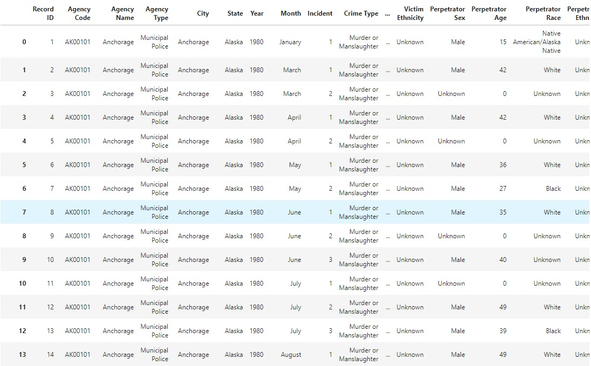
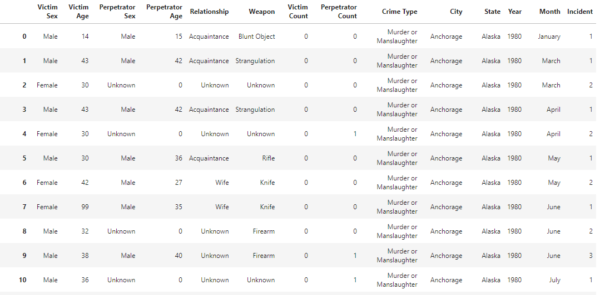

# Analyzing dataset to find possible pattern in crime

## Introduction
The reason for this project is to apply and practice the knowledge I learned in Data Science Fundamental this semester. Through data analysis and data visualization, discover the pattern between the perpetrator and the victim or the possible crime pattern to help people avoid possible risks.

## Selection of Data

The dataset processing is conducted using a Jupyter Notebook and is available [here](https://github.com/liur1wit/DS_Final/blob/main/Final%20Project.ipynb).

The data has over 638454 cases with 24 features. The data was compiled and made available by the Murder Accountability Project, founded by Thomas Hargrove. The dataset includes the age, race, gender, ethnicity of the victim and the perpetrator, as well as the relationship between the victim and the perpetrator and the weapon used. I use drop table to remove some columns that are not useful for the data analysis.
The dataset can found online at [kaggle](https://www.kaggle.com/murderaccountability/homicide-reports)[4]. 

Data preview: 

Since the contents of many columns in the original dataset are unchanged, it is not helpful for the analysis, so I dropped some columns.

## Methods

Tools:
- NumPy, and Pandas for data analysis 
- matplotlib.pyplot and seaborn for data visualization
- GitHub for version control
- Jupyter Notebook as IDE

## Results

Even without data visualization, we can quickly get some key information by using the value_counts() and idxmax() functions.

Through the bar graph of crimes occurring in each year, we can find that there was no significant increase in cases between 1980 and 1999, and even a downward trend. However, since 2000, the number of cases has increased greatly; especially after the 2008 financial crisis, the number of cases reached a peak.

We can find that the top three states with the most cases are California, Texas and New York. This also confirms that the more prosperous cities are also accompanied by more crimes, and at the same time, Texas law has led to the widespread use of guns among the people.

Through the bar graph on gender, we can clearly see that men account for a huge proportion of perpetrators. Male perpetrators has approximately 400,000 murders. By comparing the bar graphs, 300,000 crime victims were men and 100,000 crime victims were women.

We can find from the pie chart that the use of handgun in murder cases reached 49.7%. The criminals' choice to use handgun shows that it has good concealment and a high fatality rate.

Regarding the analysis of the relationship between the victim and the perpetrators in the dataset, another author's surprising discovery is that even though there are approximately 270,000 data in the data set that are unknown. But in the known relationships, acquaintances commit crimes the most, even more frequently than strangers commit crimes in our conventional knowledge.

In the comparison of crimes, we can find that the two most common cases are crimes of the same race.

## Discussion

In the process of data analysis and data visualization, we can find that the occurrence of homicide cases is related to the historical background. For example, economic crises, racial antagonisms, or terrorist attacks are among the causes that directly or indirectly lead to homicides.

If you are in a state with a high number of homicides, please be extra careful. The danger may be around, make friends cautiously, and pay attention to any signs before a crisis occurs.

## Summary

Through the analysis and comparison of the victim’s gender, interpersonal relationship and weapon use, we can discover some of the higher risk factors. For example, states with higher homicide rates or people with dangerous weapons. In conclusion, try to ensure rational thinking and observation of the environment all the time.

## References
[1] [Matplotlib - Bar Plot](https://www.tutorialspoint.com/matplotlib/matplotlib_bar_plot.htm)

[2] [Panda API reference](https://pandas.pydata.org/docs/reference)

[3] [Basic pie chart](https://matplotlib.org/stable/gallery/pie_and_polar_charts/pie_features.html)

[4] [Data Science Project Sample](https://github.com/memoatwit/dsexample)

[5] [Homicide Reports, 1980-2014: Kaggle](https://www.kaggle.com/murderaccountability/homicide-reports)
